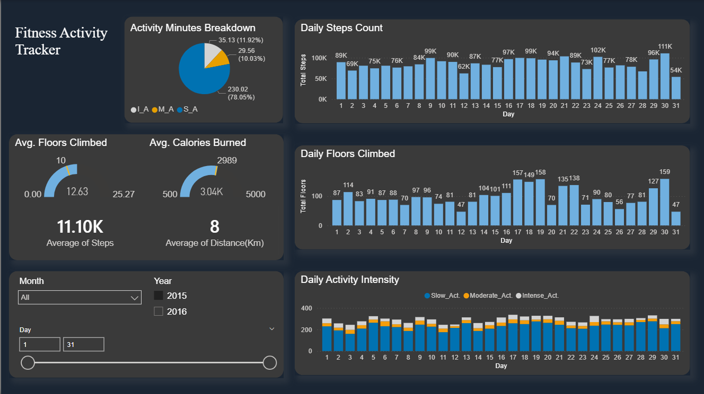

# 🏃 Fitness Activity Tracker — Power BI Dashboard

## 📌 Overview
An interactive Power BI dashboard tracking daily fitness 
activity KPIs across 2015–2016, enabling users to monitor 
performance trends and identify activity patterns over time.

---

## 🛠️ Tools Used
- Power BI Desktop
- DAX (calculated measures and KPIs)
- Data Modeling & Transformation
- Interactive Slicers and Filters

---

## 📊 Dashboard Features

### 🔍 Interactive Filters
- Filter by Month, Year (2015/2016), and Day range slider

### 📈 Visualizations
- **Activity Minutes Breakdown** — pie chart (Slow, Moderate, Intense)
- **Daily Steps Count** — bar chart across 31 days
- **Daily Floors Climbed** — bar chart with daily totals
- **Daily Activity Intensity** — stacked bar chart by intensity type
- **KPI Gauges** — Avg Floors Climbed · Avg Calories Burned

### 🏅 Key Metrics Tracked
| Metric | Value |
|--------|-------|
| Average Daily Steps | 11,100 |
| Average Distance | 8 km/day |
| Average Calories Burned | 3,040 |
| Average Floors Climbed | 12.63 |

---

## 💡 Key Insights Delivered
- 78% of activity minutes were slow activity — 
  flagging opportunity to increase moderate/intense sessions
- Peak step count reached 111K on day 30 — 
  identifying high performance days for pattern analysis
- Calorie burn consistently tracked below Max allowable target of 5,000 — 
  supporting personalized fitness goal adjustment

---

## 📷 Dashboard Preview

---

## 👤 Author
**Ahmed Mohamed Sedek** — Data Analyst
📧 ahmedsedek295@gmail.com
🔗 [LinkedIn](https://www.linkedin.com/in/ahmed-sedek-2869a1244)
🌍 Cairo, Egypt · Open to remote opportunities
